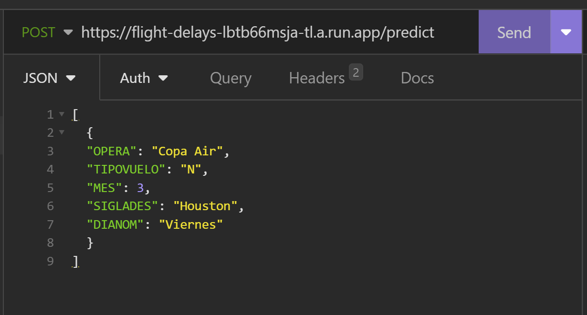
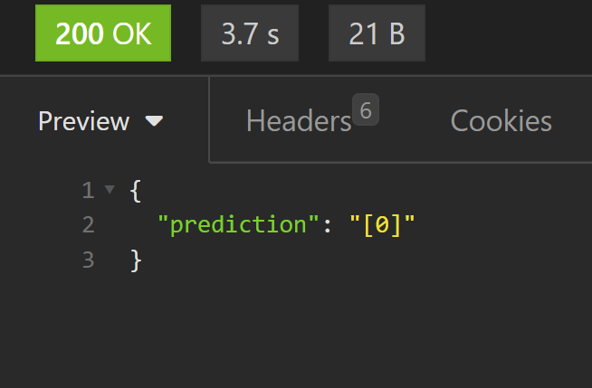
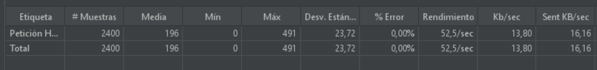

# flight-delays
## Por Nicolás Grágeda
En este documento se presenta un resumen del trabajo realizado para el challenge técnico.

El entrenamiento, selección y serialización del modelo se encuentra en el archivo to-expose.ipynb, mientras que los archivos para el build y deploy automático de la API se encuentran en la carpeta "./API".

## 0. Correcciones y mejoras al trabajo de Juan

-Se corrige el cálculo de la tasa de atraso de juan.
-Se corrige el orden de upsampling de Juan (primero se debe separar en test y train, después se puede hacer upsampling).
-Se optimiza la función "calcular_tasa", pasa de tardar 20s en calcular las tasas para un columna a tardar menos de 0.1s.

## 1. Elección del modelo

Se observa que la información entregada por los modelos implementados por Juan sobre los atrasos es casi nula, pues el modelo posee un sesgo que lo lleva a "predecir" casi el 100% de las veces que no habrá atraso (clase 0) y con esto alcanza un accuracy de casi 82%, el cuál es parecido a la tasa de "no atrasos" de la partición de test.

No obstante, los modelos si son capaces de entregar información sobre los atrasos si se cambia el umbral de desición. Esto se ve mejor reflejado en la curva ROC que grafica el efecto de este cambio de umbral en el "true positive rate" y en el "false positive rate". Es por esto que se elige el ROC-AUC como métrica para determinar el mejor modelo.

Dado lo anterior se observa que el mejor modelo se obtiene con XGBClassifier utilizando Grid Search, con las features originales y sin upsampling:

**Best parameters: {'learning_rate': 0.05, 'n_estimators': 50, 'subsample': 0.9}**

De ahora en aquí en adelante se utiliza ese modelo como baseline.

## 2. Implementación de cambios para mejorar el modelo

### 2.1 Uso de más features

Al observar lso resultados obtenidos por Juan se logra notar que existen otras características del dataset que presentan una varianza considerable entre sus tasas de atraso. Puede que él no haya notado su importancia debido al error en el cálculo de tasas de atraso.

Las nuevas features a incluir son:

**-SIGLADES**

**-DIANOM**

Se observa que el ROC-AUC mejora levemente con la inclusión de estas nuevas características, además se hace el análisis de importancia de features y dentro de las más importantes se encuentran **SIGLADES** y **DIANOM**. De aquí en adelante se agregan estas dos columnas al modelo.

### 2.2 Uso de partición de validación para evitar overfitting

Se plantea la posibilidad de que exista overfitting, por lo que se crea una partición de validación a partir de train set con el fin de evitar esto. No se observan cambios en el rendimiento, pero se mantiene este cambio de aquí en adelante, pues puede evitar futuros overfitting. 

### 2.3 Uso de pesos para abordar el desbalance de clases

El parámetro "scale_pos_weight" está diseñado específicamente para abordar situaciones en las que el número de muestras de la clase positiva es significativamente inferior al número de muestras de la clase negativa. Permite ajustar la importancia relativa de la clase positiva (clase 1) en el proceso de entrenamiento asignándole un peso mayor. Representa "número de muestras de clase negativa" dividido en el "número de muestras de clase positiva".

Se concluye que a pesar que el ROC-AUC se mantiene constante, el nuevo punto de operación del modelo con TPR y TNR equilibrados (0.67 y 0.59) cumple mejora la tarea de entregar información al respecto de los atrasos y no atrasos, además se logra eliminar el sesgo (el modelo ya no predice el 99% de las veces que será "no atraso").

### 2.4 Uso de otro tipo de codificación para las features (codificación por tasa de atraso)

Se observa que la forma de encodear las features (one hot encoding) puede no ser la óptima, debido a que para una sola feature agrega demasiados nodos de entrada. Se propone el uso de la tasa de atraso por feature para la codificación.
Por ejemplo, si se tiene:
|     **Aerolinea**     | **Tasa de atraso en Train[%]** |
|:---------------------:|:----------------------:|
|      Grupo LATAM      |          18          |
|      Sky Airline      |          18          |
| Aerolineas Argentinas |          24          |
|        Copa Air       |           6          |
|  Latin American Wings |          41          |
|        Avianca        |          27          |

Entonces la codificación para la feature "SIGLADES" sería:

|     **Aerolinea**     |  **Feature SIGLADES**  |
|:---------------------:|:----------------------:|
|      Grupo LATAM      |          0.18          |
|      Sky Airline      |          0.18          |
| Aerolineas Argentinas |          0.24          |
|        Copa Air       |          0.06          |
|  Latin American Wings |          0.41          |
|        Avianca        |          0.27          |

Esto provoca que el modelo pueda servir para otras aerolineas, destinos, etc para los cuales no ha sido entrenado, ya que solo necesita su tasa de atraso para dar una predicción. Además, al reducir el número de nodos de entrada, se espera que el modelo generalice mejor.

Se observó que el rendimiento en términos de ROC-AUC no mejora con estos nuevos features. A pesar de lo anterior, se destaca la versatilidad de este nuevo tipo de codificación de features, pues se podría ocupar para destinos y aerolineas nuevas (que no están en el entrenamiento) necesitando solamente un aproximado de su tasa de retraso. Se decide **no** ocupar este tipo de codificación final pues complejiza el proceso de predicción en la API y se busca la simpleza. 

## 3. Serialización del modelo y construcción de la API

### 3.1 Serialización

El modelo seleccionado es aquel que utiliza pesos y fue entrenado con las features 'OPERA', 'TIPOVUELO', 'MES', 'SIGLADES' y 'DIANOM'. A continuación se guarda el modelo con el nombre **modelxgb_con_pesos.pickle** en la carpeta "./API" y las columnas necesarias con en la misma carpeta con el nombre **columns_modelxgb_con_pesos.pickle**.

### 3.2 API REST

En la carpeta "./API" se guardan los archivos "main.py" (el cuál contiene la API como tal), "requirements.txt" (contiene las librerías y versiones de estas necesarias para la ejecución de la API) y "Dockerfile.txt" (Se encarga de realizar el build y deployement de forma automática).

## 4. Build deployement en la nube (GCP)

Se elige GCP para realizar este trabajo, esta plataforma posee la funcionalidad "Cloud Run" perfecta para realizar el deployement de una API por las siguientes razones:

-**Escalabilidad**: Cloud Run permite escalar automáticamente la infraestructura subyacente según la demanda. Esto significa que mi API puede manejar fácilmente altas cargas de tráfico sin problemas de rendimiento.

-**Flexibilidad**: Cloud Run admite contenedores de Docker, lo que me brinda flexibilidad para empaquetar y desplegar mi modelo de ML junto con todas sus dependencias. Puedo usar cualquier biblioteca o herramienta específica que necesite para mi modelo, sin preocuparme por las restricciones del entorno de ejecución.

-**Portabilidad**: Al utilizar contenedores Docker, puedo garantizar que mi aplicación funcionará de manera coherente en cualquier entorno que admita Docker. Esto significa que puedo cambiar fácilmente de Cloud Run a otros servicios de Google Cloud Platform (GCP) o incluso a otros proveedores de nube sin tener que realizar cambios significativos en mi código.

La forma de utilizar la API es la siguiente:
-Mandar una request de "POST" con una lista de objetos JSON a predecir a "https://flight-delays-lbtb66msja-uc.a.run.app/predict"

-Se recibe un JSON de respuesta con la predicción:

## 5. Prueba de estrés
Se realiza una prueba de estrés con la herramienta "Apache Jmeter", sin embargo no se logra llegar a las 50000 request. Los resultados se muestran a continuación:

Para optimizar la API se podría utilizar caché, de tal forma que las request repetidas, no deban ser procesadas por el modelo de ML.